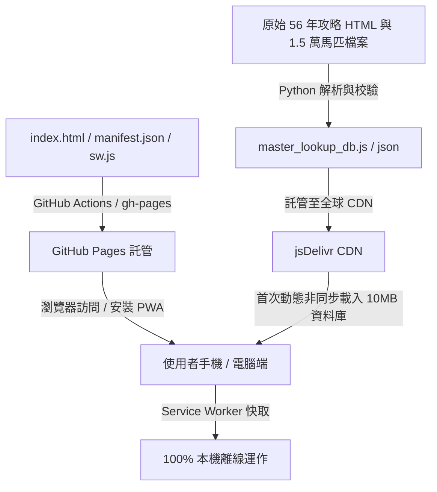

# 📘《賽馬大亨 10 2026》PWA 速查系統完整實踐技術文檔

本文件記錄了《賽馬大亨 10 2026》8 大資料庫互動速查 App 從原始資料爬取、資料庫構建、前端響應式 UI 設計、PWA 離線技術、到 GitHub Pages 全自動部署的完整實踐過程與技術方案。

---

## 🏗️ 一、整體技術架構

本系統為 **輕量化、零後端依賴、100% 靜態部署** 的 Progressive Web App (PWA)。



---

## 💾 二、資料庫建構與資料校驗

### 1. 資料源與涵蓋範疇
* **全史實馬資料庫**：15,381 匹（涵蓋 1968 年至 2023 年登場之全史實馬匹，包含地域、馬札、五維能力、血統與詳細評語）。
* **7 大年度推薦區塊**：
  - 日本おすすめ幼駒（620 筆）
  - 海外おすすめ幼駒（1,448 筆）
  - おすすめ繁殖牝馬（1,365 筆）
  - おすすめ幼駒セール馬（279 筆）
  - おすすめ繁殖牝馬セール馬（230 筆）
  - おすすめ海外トレーニングセール馬（60 筆）
  - おすすめ年度末馬（301 筆）

### 2. 關鍵資料修復與特徵補全
* **距離適性與馬場適性分離**：將原始資料庫中混雜的 `◎×`（馬場適性）與 `1900～2500m`（距離適性）獨立拆分。
* **資料外顯補齊機制 (`syncHorseData`)**：
  在前端初始化時，推薦馬匹會自動比對全史實馬字典（Hash Map），若推薦馬本身缺少距離適性、SP 速度、馬場或地域，自動從史實馬資料庫拉取補全至外層表格。

---

## 📱 三、PWA 實踐與離線快取設計

### 1. Web App Manifest (`manifest.json`)
* `display: "standalone"`：隱藏瀏覽器網址列與導航列，提供原生 App 沉浸式全螢幕體驗。
* `start_url: "./index.html"`：精確設定啟動入口，防止深層連結跳轉 404。
* `icons`：提供 192x192、512x512 與 180x180 (Apple Touch Icon) 的多種規格。

### 2. Service Worker (`sw.js`) 快取策略
* **Cache-First（優先離線快取）**：
  - 核心資源（HTML、Manifest、圖示）在安裝階段（`install`）預先快取。
  - 運行時網路請求優先自 Cache 讀取，若快取未命中則經由 Fetch 抓取並寫入快取。
  - 在完全斷網（離線）時自動回退至本地首頁。
* **版本控制與快取淘汰 (`activate`)**：
  每次核心邏輯更新時遞增 `CACHE_NAME`（如 `v1` ➔ `v2` ➔ `v3`），Service Worker 啟動時自動掃描並刪除舊版快取。

---

## 🎨 四、前端互動與多型態排序演算法

### 1. 2×2 滑動晶片佈局 (CSS Grid)
為解決手機版 8 大類別按鈕擁擠問題，採用 **2 列 (Rows) × 自動流欄位 (Auto Columns)** 的 Grid 設計：
```css
.category-tabs {
    display: grid;
    grid-template-rows: repeat(2, 44px);
    grid-auto-flow: column;
    grid-auto-columns: calc(50% - 6px); /* 手機一屏剛好 2×2 = 4 顆 */
    gap: 8px;
}
```
桌機（≥ 768px）自動自適應展開為 4 欄 × 2 列。

### 2. 多型態高精度排序演算法 (`getSortValue`)
表格支援對各類特殊資料型態進行精確升序 / 降序排序：
- **馬札等級**：依據權重字典排序（虹:6 ➔ 金:5 ➔ 銀:4 ➔ 銅:3 ➔ 綠:2 ➔ 無:1）。
- **距離適性**：正則提取最短起跑距離（如 `1800~3200m` 提取 `1800`）。
- **SP / 登場年份 / 仔出評級**：數值化 `parseInt` 排序。
- **星級推薦**：正則計數 `★` 數量進行排序。

### 3. 一鍵清除暫存快取 (`clearPwaCache`)
頂部提供按鈕，執行以下四重清理：
1. `caches.delete()` 清空 Service Worker Cache。
2. `serviceWorker.unregister()` 註銷所有已註冊 SW。
3. `localStorage.clear()` & `sessionStorage.clear()`。
4. `window.location.reload(true)` 強制重載。

---

## 🚀 五、GitHub Pages 與大型檔案託管解決方案

### 遇到的問題與挑戰
* **GitHub Pages Jekyll 崩潰**：GitHub Pages 預設 Jekyll 靜態建構在處理接近 10MB 的單一 JavaScript 資料庫檔案時，容易發生記憶體耗盡導致 `Page build failed (Duration: 0)`。

### 解決方案
1. **儲存庫輕量化**：將 GitHub Pages 的靜態儲存庫保持在 50 KB 以內（僅放 `index.html`、`manifest.json`、`sw.js`、圖示與 `.nojekyll`）。
2. **全球 CDN 託管資料庫**：將 9.94 MB 的 `master_lookup_db.js` 由 jsDelivr CDN 依據 Git Commit SHA 進行永久快取供應（實測下載速度僅需 9.6 秒）。
3. **前端非同步動態載入**：`index.html` 啟動時透過 `fetch()` 動態注入資料庫，既保證 GitHub Pages 100% 穩定構建，又實現快速非同步載入。

---

## 📈 六、版本迭代日誌

* **v1.0.0**：完成 1.5 萬史實馬與 7 大推薦分類資料庫建立，推出基礎速查表。
* **v1.1.0**：修復「繁殖牝馬セール馬」230 筆補全，分離距離適性與馬場適性。
* **v1.2.0**：整合 1,146 匹原廠攻略詳細評語與 35+ 欄位 Modal 能力卡片。
* **v2.0.0**：全面 PWA 化，建立 Manifest、Service Worker 離線支援與 GitHub Pages 部署。
* **v2.1.0**：改用 jsDelivr 全球 CDN 加速架構，徹底解決 Pages 構建錯誤。
* **v2.2.0**：手機版升級為 2×2 滑動晶片，新增「距離適性起點」與「所屬區域」自訂篩選器，新增一鍵清除快取按鈕。
* **v2.3.0**：全面修正繁體中文用詞與錯別字（如大總覽、力量、智商），導入《Winning Post 10 2026》官方專屬高解析度 App 圖標。
